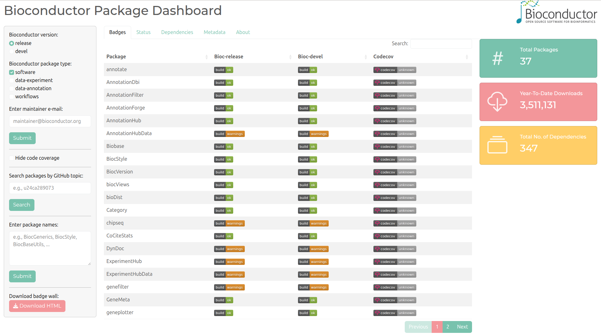
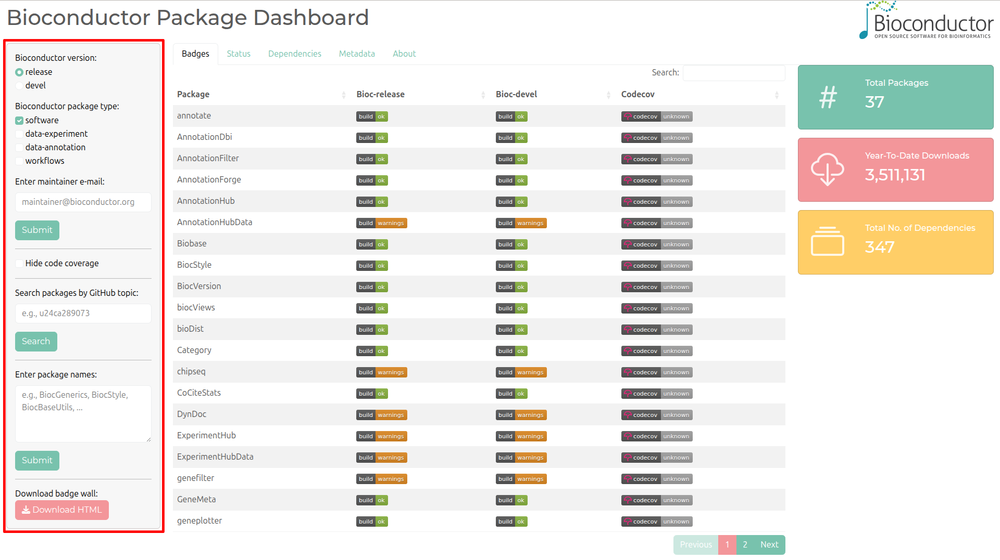
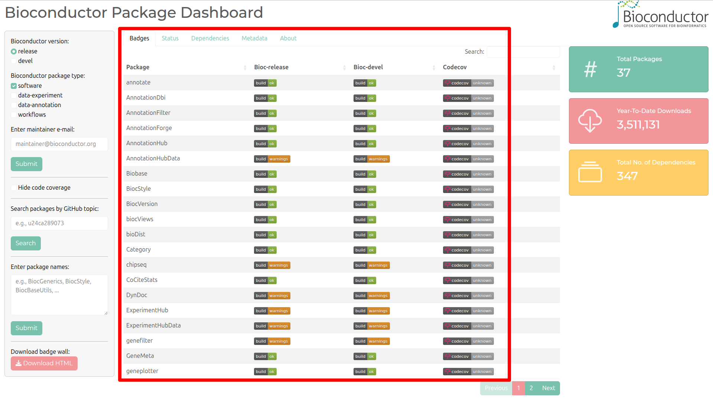
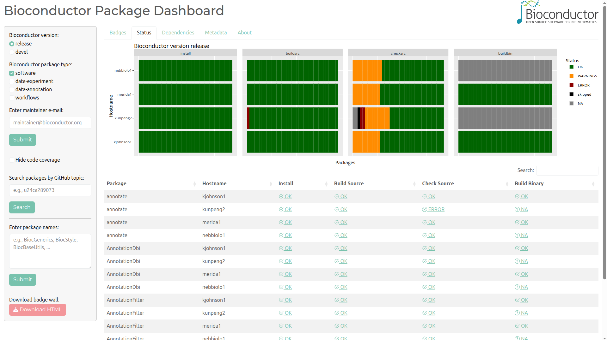

# BiocPkgDash

# Introduction

The BiocPkgDash package provides an interactive Shiny application to
visualize the status of Bioconductor packages. Primarily, users can
filter packages by maintainer email to display a status badge wall for
all packages maintained by that email. It allows users to filter
packages based on various criteria, such as Bioconductor version,
package type, and GitHub topics. The dashboard displays badges
indicating the build status and code coverage for each package. The tool
is primarily designed for Bioconductor package maintainers to monitor
the status of their packages.

## Comparison to Bioconductor Build Results

The Bioconductor Build Results
[page](https://bioconductor.org/checkResults) provides a comprehensive
overview of the build status of all Bioconductor packages. However, it
can be overwhelming for maintainers who are only interested in the
status of their own packages. The `BiocPkgDash` dashboard provides a
more focused view of the status of packages maintained by a specific
email, allowing maintainers to quickly identify any issues with their
packages without having to navigate through the entire list of packages
on the Build Results page.

Users can quickly go the relevant section in the Bioconductor Build
Results page by clicking on the badges or the status bars in the
dashboard. This allows maintainers to easily access more detailed
information about the build status of their packages.

# Installation

``` r
if (!requireNamespace("BiocManager", quietly = TRUE))
    install.packages("BiocManager")

BiocManager::install("BiocPkgDash")
```

# Loading

``` r
library(BiocPkgDash)
```

Note that the app uses
*[BiocPkgTools](https://bioconductor.org/packages/3.23/BiocPkgTools)* to
download package information from the Bioconductor Build System (BBS)
database. This is required for the app to function properly and can be
safely created. The prompt may look like the following (path varies by
operating system):

    /Users/user/.cache/R/BiocFileCache
        does not exist, create directory? (yes/no): yes

Create the cache directory by entering `yes` and pressing `Enter`.

# Dashboard display

``` r
BiocPkgDash()
```



Note that the dashboard and this document is organized by the tab
panels. Each tab in the dashboard is described in the following
sections.

## Filtering packages

One can filter packages by name, Bioconductor version, biocViews package
type, maintainer email, and GitHub topics. The dashboard will display
the status badges for all packages that match the selected criteria.
Typically, a user with use one of the methods to filter for packages.
Primarily, the user will filter by the relevant maintainer email.



### GitHub topic filter

The GitHub topic filter allows users to filter packages based on
specific topics associated with R / Bioconductor packages on GitHub.
This can be useful for organizations that maintain multiple packages
related to a specific project, theme, or grant. For example, one can
filter for all packages related to a particular grant code, e.g.,
“u24ca289073”. Note that repositories will have to have the topic added
to them for the filter to work.

# Badges

The badge wall displays the build status and code coverage for each
package. Clicking on a badge will take you to the relevant page for more
details.



Note that the coverage badges can be turned off if the maintainer does
not use codecov.io for testing package coverage.

## Downloading the badge wall

The dashboard allows users to download the badge wall as a partial HTML
file. This can be useful for including the badges on personal websites
or other HTML documentation. The HTML file is generated on the fly by
the `shiny` app after clicking the `Download HTML` button on the sidebar
panel.

# Status

The dashboard also provides a visualization of the package build
statuses across different stages of the Bioconductor Build System (BBS).
This helps maintainers quickly identify any issues with their packages.



Note that clicking on any of the status bars in the plot takes the user
to the detailed build report for that specific builder, stage, and
status combination.

# Dependencies

The `Dependencies` tab displays the package reverse dependencies for a
selected package. This can help maintainers understand the dependency
tree of their packages and identify any potential issues.

# Metadata

The `Metadata` tab displays additional information about the selected
package(s) such as the package title, version, and additional fields
from the `DESCRIPTION` file as obtained from the internal `biocViews`
database. This can help maintainers quickly access information about
their package(s).

# Session Information

``` r
sessionInfo()
#> R Under development (unstable) (2025-10-28 r88973)
#> Platform: x86_64-pc-linux-gnu
#> Running under: Ubuntu 24.04.4 LTS
#> 
#> Matrix products: default
#> BLAS/LAPACK: /usr/lib/x86_64-linux-gnu/openblas-pthread/libopenblasp-r0.3.26.so;  LAPACK version 3.12.0
#> 
#> locale:
#>  [1] LC_CTYPE=en_US.UTF-8       LC_NUMERIC=C               LC_TIME=en_US.UTF-8       
#>  [4] LC_COLLATE=en_US.UTF-8     LC_MONETARY=en_US.UTF-8    LC_MESSAGES=en_US.UTF-8   
#>  [7] LC_PAPER=en_US.UTF-8       LC_NAME=C                  LC_ADDRESS=C              
#> [10] LC_TELEPHONE=C             LC_MEASUREMENT=en_US.UTF-8 LC_IDENTIFICATION=C       
#> 
#> time zone: America/New_York
#> tzcode source: system (glibc)
#> 
#> attached base packages:
#> [1] stats     graphics  grDevices utils     datasets  methods   base     
#> 
#> other attached packages:
#> [1] BiocPkgDash_0.99.39 shiny_1.12.1        colorout_1.3-2     
#> 
#> loaded via a namespace (and not attached):
#>  [1] tidyselect_1.2.1     viridisLite_0.4.2    dplyr_1.1.4          farver_2.1.2        
#>  [5] blob_1.2.4           filelock_1.0.3       S7_0.2.1             bitops_1.0-9        
#>  [9] fastmap_1.2.0        RCurl_1.98-1.17      lazyeval_0.2.2       gh_1.5.0            
#> [13] BiocFileCache_3.1.0  BiocPkgTools_1.29.2  promises_1.5.0       XML_3.99-0.20       
#> [17] digest_0.6.39        timechange_0.4.0     mime_0.13            lifecycle_1.0.4     
#> [21] processx_3.8.6       RSQLite_2.4.5        magrittr_2.0.4       compiler_4.6.0      
#> [25] rlang_1.1.6          tools_4.6.0          igraph_2.2.1         yaml_2.3.12         
#> [29] data.table_1.18.2.1  knitr_1.51           htmlwidgets_1.6.4    bit_4.6.0           
#> [33] curl_7.0.0           xml2_1.5.1           RColorBrewer_1.1-3   rsconnect_1.7.0     
#> [37] websocket_1.4.4      purrr_1.2.0          BiocGenerics_0.57.0  grid_4.6.0          
#> [41] stats4_4.6.0         xtable_1.8-4         ggplot2_4.0.1        scales_1.4.0        
#> [45] dichromat_2.0-0.1    cli_3.6.5            rmarkdown_2.30       generics_0.1.4      
#> [49] otel_0.2.0           rstudioapi_0.18.0    httr_1.4.7           tzdb_0.5.0          
#> [53] BiocBaseUtils_1.13.0 RUnit_0.4.33.1       DBI_1.2.3            cachem_1.1.0        
#> [57] chromote_0.5.1       stringr_1.6.0        rvest_1.0.5          BiocManager_1.30.27 
#> [61] vctrs_0.6.5          jsonlite_2.0.0       hms_1.1.4            bit64_4.6.0-1       
#> [65] RBGL_1.87.0          plotly_4.11.0        tidyr_1.3.1          glue_1.8.0          
#> [69] codetools_0.2-20     ps_1.9.1             DT_0.34.0            lubridate_1.9.4     
#> [73] stringi_1.8.7        gtable_0.3.6         later_1.4.4          tibble_3.3.0        
#> [77] pillar_1.11.1        rappdirs_0.3.4       htmltools_0.5.9      graph_1.89.1        
#> [81] R6_2.6.1             dbplyr_2.5.1         httr2_1.2.2          evaluate_1.0.5      
#> [85] Biobase_2.71.0       readr_2.1.6          memoise_2.0.1        httpuv_1.6.16       
#> [89] Rcpp_1.1.1           xfun_0.56            whisker_0.4.1        biocViews_1.79.0    
#> [93] pkgconfig_2.0.3
```
